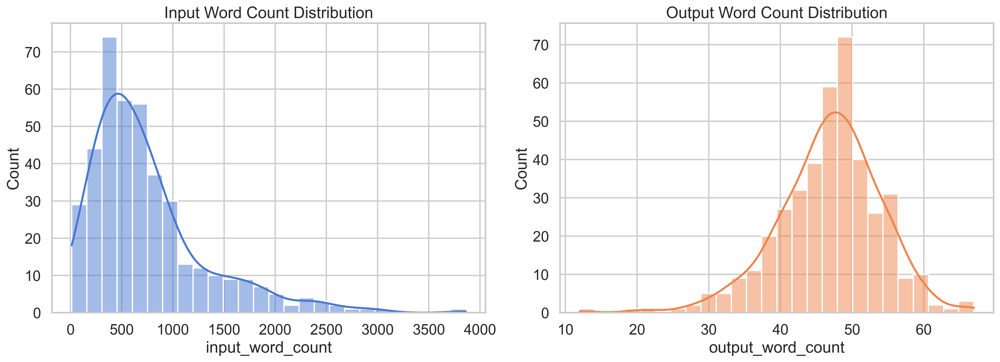
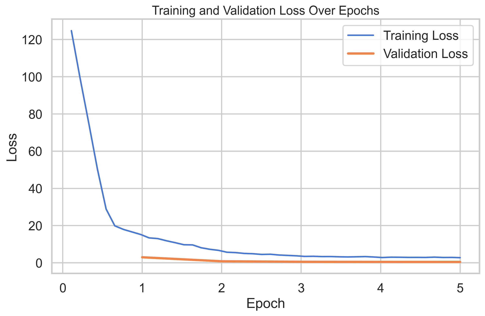
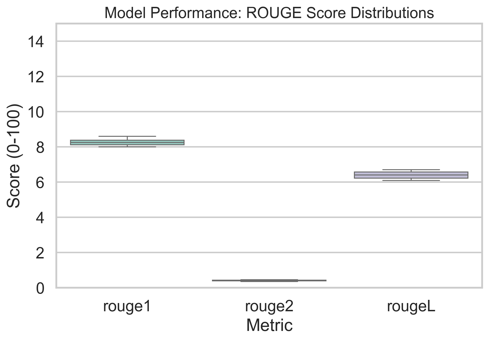
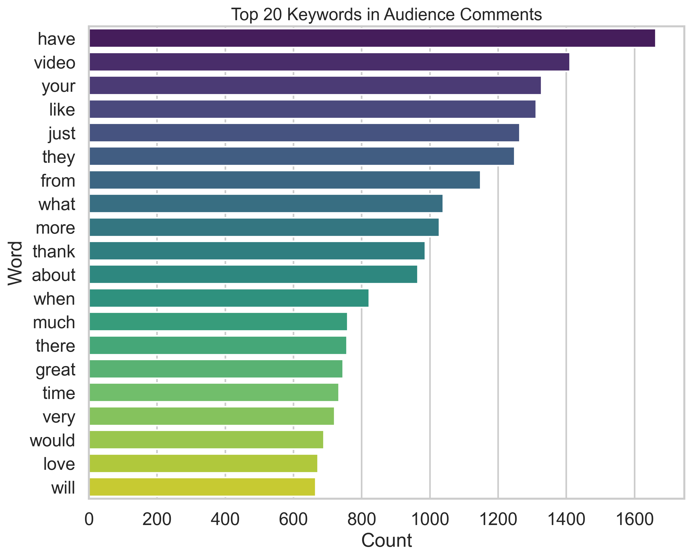

# YouTube Data Pipeline (YTCBERT)

A high-performance system designed to extract YouTube transcripts and comments at scale, followed by AI-powered summarization and dataset exportation for fine-tuning `FLAN-T5` into **YTCBERT** — a specialized sequence-to-sequence model capable of summarizing audience sentiment. Optimized for local execution and accelerated by Intel Extension for PyTorch (IPEX).

## 📊 Dashboard & Visualisations
*A glimpse into the dataset distribution and model training metrics:*

<p float="left">
  
   
</p>
<p float="left">
  
  
</p>

## 📂 Project Architecture

The project is structured into four distinct phases:

```text
YTCBERT/
├── Video_Pipeline/       # Phase 1: Data Extraction & Discovery
│   ├── pipeline.py       # High-speed data extraction (Checkpointed)
│   ├── tools/            # Utilities for discovery, maintenance, and auditing
│   ├── utils/            # Core logic (LLM, Helpers, Formatters)
│   └── data/             # Input and fetched raw data
│
├── Data_Preprocessing/   # Phase 2: Cleaning & Summarization
│   ├── clean_pipeline.py # Text normalization and cleaning
│   ├── summarizer.py     # Generates ground-truth summaries using an LLM
│   └── processor.py      # Prepares the summaries for the dataset
│
├── Model_Training/       # Phase 3: Fine-Tuning (IPEX Optimized)
│   ├── 01_acquire_model.py     # Downloads base `flan-t5-base`
│   ├── 02_prepare_data.py      # Formats data for sequence-to-sequence training
│   ├── 03_fine_tune.py         # The Trainer (Optimized for Intel XPU / GPUs)
│   ├── 04_inference.py         # Batch inference testing
│   ├── 06_evaluation.py        # Model evaluation metrics (ROUGE, etc.)
│   └── 07_interactive_inference.py # Interactive CLI inference
│
└── Visualisations/       # Phase 4: Analysis & Reporting
    ├── generate_vis.py   # Generates HTML and PNG charts of training loss & data
    └── ...               # Exported graphs and markdown reports
```

## ⚙️ Key Features

*   **End-to-End Pipeline**: From discovering YouTube videos to exporting a finalized `jsonl` model training dataset.
*   **Intel GPU (XPU) Acceleration**: Incorporates `intel_extension_for_pytorch` to natively optimize and accelerate model training on Intel hardware.
*   **Checkpointing & Resilience**: Safe to interrupt. The scrapers and extractors maintain state and resume gracefully.
*   **Data Analysis Dashboard**: Comprehensive visual tracking of model training loss, learning rate, and dataset semantic distribution.

## 🛠️ Setup & Installation

1.  **Clone & Environment Setup**:
    ```bash
    git clone https://github.com/your-username/YTCBERT.git
    cd YTCBERT
    python -m venv venv
    
    # Activate virtual environment
    # Windows:
    .\venv\Scripts\Activate.ps1
    # Linux/Mac:
    source venv/bin/activate
    
    # Install dependencies
    pip install -r requirements.txt
    ```

2.  **Configuration**:
    Create a `.env` file in the project root containing your API keys:
    ```env
    LLM_API_KEY=your_openai_or_gemini_key
    YOUTUBE_API_KEY=your_youtube_data_api_key
    ```

3.  **Hardware Check**:
    Run the `run.py` utility to ensure PyTorch and IPEX (Intel Extension for PyTorch) are correctly detecting your GPU:
    ```bash
    python run.py
    ```

## 📖 Usage Guide

> [!IMPORTANT]
> All scripts should be run from the **project root** directory to ensure paths resolve correctly.

### 1. Data Collection (`Video_Pipeline`)
Manage your video lists, discover content, and extract raw transcripts and comments.
```bash
python Video_Pipeline/pipeline.py
```

### 2. Preprocessing (`Data_Preprocessing`)
Clean the scraped YouTube data and use a larger LLM to generate the ground-truth summaries that will be used to fine-tune the model.
```bash
python Data_Preprocessing/clean_pipeline.py
python Data_Preprocessing/summarizer.py
```

### 3. Model Training (`Model_Training`)
Acquire the base `flan-t5` model, prepare the dataset, and launch the IPEX-optimized training loop.
```bash
python Model_Training/01_acquire_model.py
python Model_Training/02_prepare_data.py
python Model_Training/03_fine_tune.py
```

### 4. Evaluation & Visualisation (`Visualisations`)
Track performance using the evaluation scripts and generate your dashboards.
```bash
python Model_Training/06_evaluation.py
python Visualisations/generate_vis.py
```