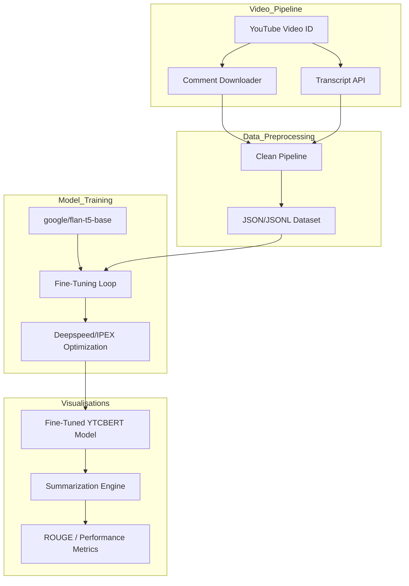

# YTCBERT Architecture Diagram Description

This technical description outlines the end-to-end pipeline for YTCBERT, from data acquisition to model inference.

## Conceptual Overview

YTCBERT follows a **Modular AI Pipeline** architecture consisting of four main stages:

### 1. Data Acquisition (Video_Pipeline)
- **YouTube API/Scrapers**: Fetches raw video comments and transcripts based on Video IDs.
- **Raw Storage**: Data is stored in temporal JSON/JSONL buffers before being passed to the cleaning stage.

### 2. Preprocessing & Foundation (Data_Preprocessing)
- **Data Cleaner**: Filters noise (spam, emojis, irrelevant text) from comments.
- **Foundation Model**: Utilizes `google/flan-t5-base` as the backbone for sequence-to-sequence summarization.
- **Teacher-Student Alignment**: Uses a "Teacher" summarizer to generate high-quality summary targets for the "Student" (Fine-tuned T5).

### 3. Training & Optimization (Model_Training)
- **IPEX Optimization**: Uses Intel Extension for PyTorch (IPEX) for native XPU (Intel GPU) acceleration.
- **Fine-Tuning Loop**: Adjusts parameters across multiple epochs using a curated summarization dataset.
- **Hardware Fallback**: Implements a robust sanity-check mechanism to fall back to CPU or NVIDIA (CUDA) if XPU initialization fails.

### 4. Inference & Analytics (Visualisations)
- **Summarization Engine**: Generates concise "Comment Personas" and high-level video insights.
- **Metrics Evaluator**: Real-time monitoring of ROUGE scores and latency to ensure summary fidelity, with visual dashboard generation.

---

## Mermaid Diagram Description (Flowchart)

You can render this description directly in a Mermaid-compatible editor:

